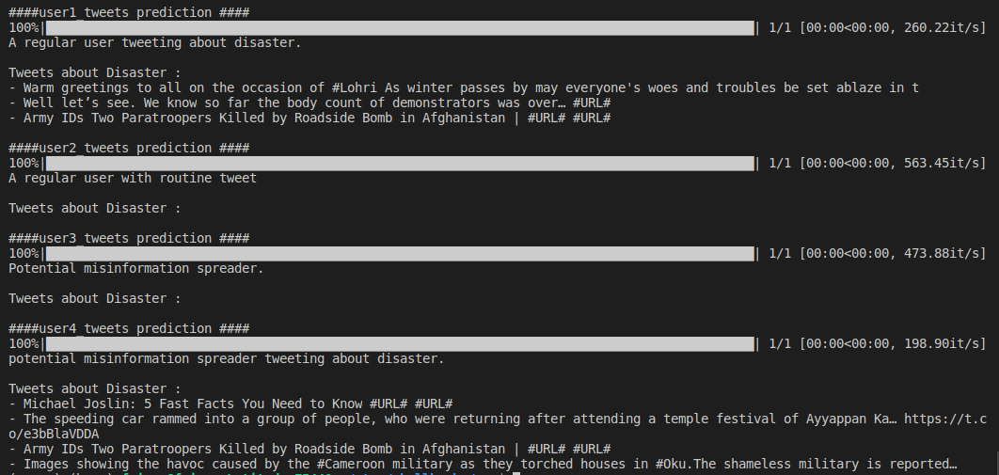

# Detecting Potential Misinformation Spreaders during Disaster.
**This project was made during `ShellHacks2020` for `#HealthyConversations` challenge.**
Demo can be found **[here.](https://www.youtube.com/watch?v=R7qgnh9YbPE)**

#### Problem Statement:
Social media platforms are important and powerful means of communication. Twitter also provides a platform where information is exchanged every second through conversations. Unfortunately, spread of misinformation is demaging the reputaion of these platforms and could cause huge loss. The spread of misinformation is especially troublesome in case of disasters.Natural Language Processing techniques can be applied to detect twitter users who are potential misinformation spreaders and their tweets could be analysed more closely in case of disaster to stop the spread of misinformation as effectively as possible.

#### Data:
Two datasets were used for this project.
1) Data for profiling Fake News spreaders is can be found [here.](https://pan.webis.de/clef20/pan20-web/author-profiling.html#data)
2) Dataset for detecting tweets about disaster is available [here.](https://www.kaggle.com/c/nlp-getting-started)

#### TASK:

Given a list of tweets for each user, build model(s) which could classifiy 
* Potential misinformation spreader or Not.
* Disaster or Not.

The possible outcomes could be.
* A regular user with routine tweet.
* A regular user tweeting about disaster.
* Potential misinformation spreader.
* Potential misinformation spreader tweeting about disaster.

#### Approach:
* `src/chi_square_filtering.py :`Each user have 100 tweets and not all of them are important for classification. Filter out most important tweets for each user using chi-square.
* `src/preprocessing.py :`Basic preprocessing for tweets e.g replace url with #URL# 
* `01_model_training.ipynb` contains models fitted to both datasets. Naive Bayes is used to build the model. Model have been trained and stored in `model` folder.

**Here is how we could make a sample prediction :**
- **Step 1 (optional):** Instructions for making virtual environment could be found [here](https://docs.python.org/3/tutorial/venv.html "here")

- **Step 2:** Type the following command to install necessary libraries:

    ```
    pip install -r requirements.txt
    ```
- **Step 3:** `sample.json` contains some tweets from a user. Type following to check if it is a potential misinformation spreader or someone who tweets about disaster or both.
    ```
    python predict_sample.py
    ```
**Output for sample**:


#### Evaluation: 
Accuracy was used as metric bacause the classes are balanced. 3 folds cross-validation was used to report the results.
- Misinsformation spreader or not ? `72 %`
- Disaster or not ? `85 %`

